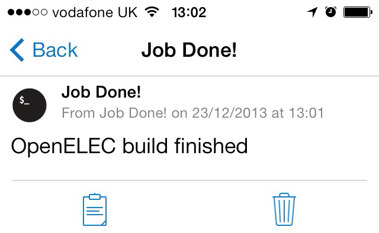

Job Done
========

A simple [Pushover](http://pushover.net/) applet to notify you when a process has finished execution.

Inteded use case
----------------
Job Done is extremely simple. I created it with the idea that one might want to start a process in the shell, leave it unattended and await a push notification to tell them when it's finished.
For instance, starting a compile job:
  make ; job-done "Some-application build"
In this case, once the software has compiled, a push notification would be sent with the message "Some-application build finished".

Get started
-----------
Well, there's not much to be done. Simply get the script, add your Pushover API key, then place it somewhere in your `$PATH`.

Take a look
-----------

